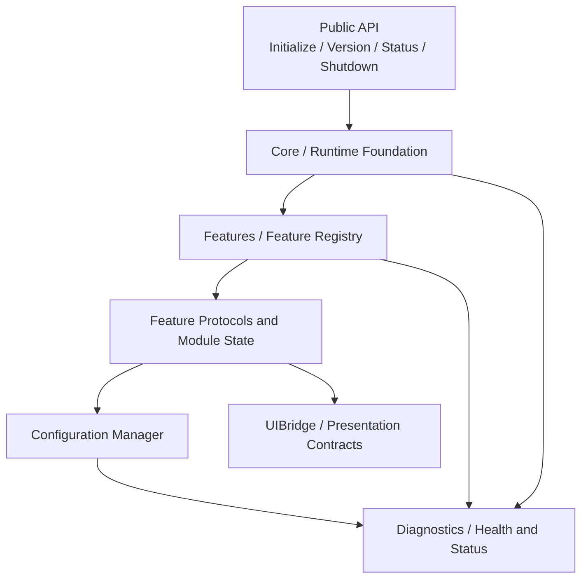

# TIKTIGER_ARCHITECTURE_FOUNDATION

## Scope

This document describes the Phase 3 foundation only. The project is an isolated Xcode Dynamic Library target. It contains no target-app linking, integration, hooks, Substrate, Theos, Logos, IPA generation, or copied reference assets.

## Architecture

## Module flow

The public API owns only lifecycle-level entry points. The Runtime Foundation manages startup and shutdown state without target-specific work. The Feature Registry is prepared to register modules and expose status snapshots, but no product feature behavior is implemented in this phase. The Configuration Manager owns defaults, validation, migration, and safe fallback. Diagnostics records runtime, feature, configuration, and error status. UIBridge contains presentation contracts only and has no UI implementation.

## Lifecycle

The runtime states are `stopped`, `bootstrapping`, `ready`, `degraded`, and `shutting_down`. Foundation startup moves from stopped to bootstrapping and then ready. Shutdown moves through shutting_down to stopped. No lifecycle state performs target-specific logic or loads a target app.

## Build information

| Setting | Value |
|---|---|
| Target type | Dynamic Library |
| Product | `Tiktiger.dylib` |
| Bundle identifier | `com.tiktiger.runtime` |
| Install name | `@rpath/Tiktiger.dylib` |
| Architecture | arm64 |
| Deployment target | iOS 14.0+ |
| Configurations | Debug and Release |
| Exported symbols | `Public/TiktigerExportedSymbols.txt` |
| Integration | Not started |
| IPA | Not created |

## Deliberate exclusions

There is no target-specific behavior, target linking, runtime hook, Substrate, Theos, Logos, binary copying, framework copying, IPA packaging, or reference modification.
