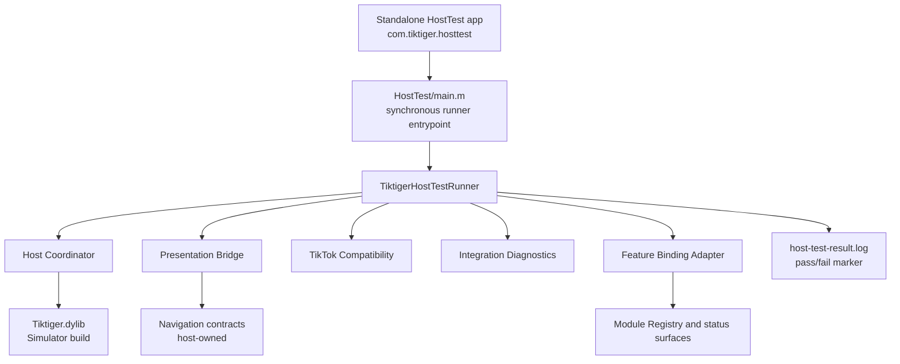

# Tiktiger Host Test Integration Report

## Executive Summary

تم تنفيذ والتحقق من بيئة HostTest مستقلة لتشغيل Tiktiger داخل تطبيق iOS مضيف مضبوط، من دون تعديل TikTok أو أي تطبيق طرف ثالث، ومن دون استخدام أو تعديل ملف IPA المرجعي. نفّذ التطبيق اختبارات runtime حقيقية على iOS Simulator، واعتمد النجاح على descriptors وحالات lifecycle التي أعادتها مكونات Tiktiger الفعلية، ثم كتب marker صريحاً إلى حاوية بيانات التطبيق قبل إنهاء العملية.

| المجال | النتيجة | الدليل |
| --- | --- | --- |
| Host Test Integration | **VERIFIED** | GitHub Actions run `32545113789` اكتمل بنجاح، وظهر `TIKTIGER_HOST_TEST_RESULT passed=YES` |
| Tiktiger.dylib | **VERIFIED** | Release Mach-O artifact مفحوص محلياً بعد تنزيله من CI |
| Core | **UNCHANGED** | لا يوجد فرق بين Phase 29 baseline `d3226679221272c78e30e912dc60b935d21b6ffd` وcommit التحقق تحت `Core/` |
| Target App Modification | **NOT DONE** | HostTest تطبيق مستقل ولا يحتوي target dependency على TikTok |
| Reference IPA Modification/Reuse | **NOT DONE** | لم تُستخدم IPA المرجعية في البناء أو الاختبار |
| New IPA Creation | **NOT DONE** | لم يتم إنشاء IPA |

## Validation Context

أُجري التحقق النهائي على commit `aff12561e895c0acc0024fc3ab6ff9ea96001e18` من مستودع [anas1213231/Tiktiger-Modern][1]. نفّذ GitHub Actions workflow على macOS runner باستخدام Xcode `26.6`، build version `17F113`، وطلب SDK `iphoneos` لنسخة Release و`iphonesimulator` لنسخة HostTest runtime. رابط التشغيل النهائي هو [GitHub Actions run 32545113789][2].

| عنصر البناء | القيمة المتحققة |
| --- | --- |
| Project | `Tiktiger.xcodeproj` |
| Scheme | `Tiktiger` |
| Host project | `HostTest/HostTest.xcodeproj` |
| Host scheme | `TiktigerHostTest` |
| Production target count | `1` |
| Dynamic Library product | `Tiktiger.dylib` |
| Production compile sources | `60` |
| HostTest Objective-C sources | `4` إجمالاً؛ app runtime يستخدم `main.m` وrunner وAppDelegate، وملف XCTest اختياري غير مستخدم في CI |
| Architecture | `arm64` |
| Deployment target | iOS `14.0+` |
| Production framework dependency | `UIKit.framework` |
| Legacy source terms | `NONE` |

## HostTest Architecture

بيئة الاختبار مستقلة عن target application. يقوم workflow ببناء نسخة Simulator من Tiktiger من production project، وينسخها مؤقتاً إلى مساحة عمل HostTest، ثم يبني تطبيق `com.tiktiger.hosttest` من المشروع المستقل. نقطة الدخول المتزامنة في `HostTest/main.m` تنشئ runner، تستدعي الاختبارات الحقيقية، تحفظ النتيجة في `Documents/host-test-result.log`، ثم تنهي العملية بحالة نجاح أو فشل. لا توجد binary artifacts ملتزمة داخل `HostTest/`.



هذه البنية تختبر runtime وcontracts داخل بيئة مضيفة مضبوطة، لكنها لا تدّعي تنفيذ presentation فعلي داخل TikTok. لذلك بقيت القيم المقصودة `targetAppIntegrated=NO` و`presentationExecution=not-performed` و`integrationStatus=foundation-only`، وهي حدود أمان وليست حالات نجاح وهمية.

## Test Cases and Results

### Runtime Lifecycle

اختبر runner التسلسل التالي على Simulator: initialize، الوصول إلى ready، استلام video context، إنشاء Dashboard descriptor، تسجيل presentation acknowledgement، close، return-to-context، ثم shutdown. تعتمد النتيجة على قيم descriptor الفعلية، وليس على تأخير زمني أو progress مصطنع.

| Assertion | Result |
| --- | --- |
| Runtime initialization reached `ready` | **PASS** |
| Video entry reached `presenting` | **PASS** |
| Dashboard descriptor surface/state | **PASS**؛ `surface=dashboard` و`state=ready` |
| Presentation acknowledgement reached `presented` | **PASS** |
| Close reached `closing` | **PASS** |
| Return-to-context reached `returned-to-context` | **PASS** |
| Host shutdown completed | **PASS** |
| Aggregate `runtime-lifecycle` | **PASS** |

Marker الناتج من artifact التقرير هو `lifecycle.passed=1` مع `initialize=ready` و`dashboard=1` و`presentation=1` و`close=1` و`returnToContext=1` و`shutdown=1`.

### Compatibility Rejection and Recovery

أُرسل metadata بإصدار مضيف غير معتمد `0.0.0-host-test`. رفضت طبقة compatibility الدخول، ثم نفّذ runner recovery bounded عبر coordinator، وبعدها تحقق من shutdown. لم يُستخدم fallback يعلن نجاحاً مسبقاً؛ النجاح يتطلب أن يكون الرفض والتعافي والحالة النهائية قد عادت من المكونات الفعلية.

| Assertion | Result |
| --- | --- |
| Unsupported host version rejected | **PASS** |
| Recovery path completed | **PASS** |
| Shutdown after recovery | **PASS** |
| Aggregate `compatibility-and-recovery` | **PASS** |

### Dashboard Routes, Feature Binding, and Diagnostics

تحقق runner من Dashboard surface ومن سبعة routes ثابتة: `media.download`، `privacy.center`، `appearance.engine`، `chat.center`، `profile.center`، `system.center`، و`system.settings`. لكل route عاد descriptor من Presentation Bridge مع `navigationExecution=not-performed`، ثم تحقق runner من binding status surfaces ووجود runtime/compatibility diagnostics history.

استخدم HostTest `dashboardFeatureCards` و`settingsFeatureControls` كإشارة binding قابلة للقراءة وغير recursive. لم يستدعِ الاختبار `diagnosticsModuleHealth` مباشرة، لأن implementation الحالية تتضمن Health Monitor يطلب health aggregate من نفس registry أثناء aggregate health enumeration؛ استدعاؤه المتداخل قد يحول اختبار العقد إلى deadlock. هذا قرار في harness فقط، ولم يغيّر Features أو Core أو production behavior. النتيجة المسجلة هي `binding=YES` مع اجتياز routes وdiagnostics checks.

| Assertion | Result |
| --- | --- |
| Dashboard contract returned | **PASS** |
| Stable route count | **PASS**؛ 7 routes |
| Route descriptors resolve through Presentation Bridge | **PASS** |
| Feature Binding dashboard status surface | **PASS** |
| Feature Binding settings control surface | **PASS** |
| Runtime diagnostics history present | **PASS** |
| Compatibility diagnostics history present | **PASS** |
| Target app integration executed | **NO، كما هو مطلوب** |

## CI Workflow Validation

نجح workflow الكامل من بداية project parsing حتى رفع artifacts. شمل ذلك `xcodebuild -list -project Tiktiger.xcodeproj`، project-structure validation، Release build، Locate للـDylib الحقيقي مع استثناء `.dSYM`، Mach-O validation، simulator build، HostTest project listing، boot/install/launch على Simulator، قراءة result file من app data container، ورفع التقارير.

| CI step | Result |
| --- | --- |
| Checkout and Xcode selection | **PASS** |
| `xcodebuild -list` for production project | **PASS** |
| Project structure validator | **PASS** |
| Release Objective-C compile/link | **PASS** |
| Locate exactly one `Tiktiger.dylib` | **PASS** |
| Mach-O architecture/install-name/exports checks | **PASS** |
| HostTest preflight | **PASS** |
| Simulator-compatible Tiktiger build | **PASS** |
| HostTest `xcodebuild -list` | **PASS** |
| Simulator boot, install, and launch | **PASS** |
| `TIKTIGER_HOST_TEST_RESULT passed=YES` | **PASS** |
| Host test report upload | **PASS** |
| Dylib artifact upload | **PASS** |

## Production Dylib Verification

تم تنزيل artifact `Tiktiger-dylib-release` من run الناجح وفحص الملف الفعلي، وليس الاعتماد على اسم artifact فقط. نتيجة `file` كانت:

> `Mach-O 64-bit arm64 dynamically linked shared library`

| Property | Verified value |
| --- | --- |
| SHA-256 | `340361a6e436bc5aaf0aa0b1d672440c9ab41c52734feb00449250476f5a688a` |
| File size | `919568 bytes` |
| Architecture | `arm64` |
| Install name | `@rpath/Tiktiger.dylib` |
| Product | `Tiktiger.dylib` |
| Xcode | `26.6 (17F113)` |

Public exports المفحوصة عبر `nm -gU` هي:

```text
_TiktigerInitialize
_TiktigerGetVersion
_TiktigerGetStatus
_TiktigerShutdown
```

و dependencies التي أظهرها `otool -L` في macOS runner هي `@rpath/Tiktiger.dylib`، `UIKit.framework`، `Foundation.framework`، `libobjc.A.dylib`، `libSystem.B.dylib`، `CoreFoundation.framework`، و`CoreGraphics.framework`. لا يحتوي artifact على IPA أو Framework bundle إضافي.

## Core and Safety Verification

قارنت المراجعة commit التحقق مع Phase 29 baseline الموجود في تاريخ المستودع. لم يظهر أي ملف متغير تحت `Core/`. كما أن production source count بقي `60`، ولم تُضف HostTest sources إلى production target أو validator count. HostTest مستقل في `HostTest/HostTest.xcodeproj`، ونسخة Dylib الخاصة بالـSimulator تُنسخ داخل CI workspace فقط ولا تُحفظ في Git.

لم يحدث أي تعديل لملف IPA المرجعي، ولم تُنسخ منه binaries أو dylibs أو frameworks، ولم تُستخدم legacy hooks أو Substrate أو Theos أو Logos. لا ينفذ الاختبار target-app navigation ولا يعلن تنزيلات أو نجاحات download غير موجودة.

## Final Status

> **HOST TEST INTEGRATION = VERIFIED**
> **DYLIB = VERIFIED**
> **CORE = UNCHANGED**

كما أن الحالة التشغيلية الآمنة بقيت كما صُممت: `targetAppIntegrated=NO`، `navigationExecution=not-performed`، و`integrationStatus=foundation-only`. هذه النتيجة تثبت سلامة runtime contracts داخل HostTest المستقل، ولا تعني تكامل TikTok الفعلي أو تعديل أي تطبيق طرف ثالث.

## References

[1]: https://github.com/anas1213231/Tiktiger-Modern "Tiktiger-Modern repository"
[2]: https://github.com/anas1213231/Tiktiger-Modern/actions/runs/32545113789 "Successful GitHub Actions run 32545113789"
[3]: https://github.com/anas1213231/Tiktiger-Modern/commit/aff12561e895c0acc0024fc3ab6ff9ea96001e18 "Validation commit aff1256"
