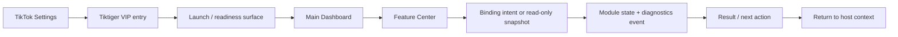

# Tiktiger VIP Product Experience Design

## حالة الوثيقة

هذه الوثيقة هي المواصفة النهائية لتجربة منتج Tiktiger VIP في Phase 31. هدفها توحيد العلامة التجارية، ونقطة الدخول، وDashboard، ورحلة المستخدم من TikTok Settings إلى المركز الوظيفي ثم العودة إلى السياق المضيف. لا تنفذ الوثيقة كودًا أو Integration جديدة، ولا تضيف Features خارج المصفوفة المعتمدة.

| العنصر | القرار النهائي |
|---|---|
| Product identity | Tiktiger VIP |
| Product artifact | `Tiktiger.dylib` |
| UI technology | Objective-C/UIKit |
| Minimum platform | iOS 14.0+ |
| Visual language | Black / White / Tiger Red / Premium Glass |
| Entry model | Host-owned Settings entry ثم Launch surface قصيرة |
| Navigation model | Stable routes عبر Presentation Bridge وFeature Binding |
| Creator Center | تجربة داخل Profile Center، وليست top-level module مستقلًا |
| State truth | كل status وprogress وsuccess/failure من snapshots/events حقيقية |
| Phase 31 output | Product Experience Design فقط |

## 1. Product Experience Decision

يُقدَّم Tiktiger بوصفه **منتجًا واحدًا متماسكًا** داخل سياق TikTok، وليس مجموعة أدوات متجاورة. يظل TikTok سطح المشاهدة الأساسي، بينما يظهر Tiktiger كسطح VIP اختياري يفتحه المستخدم من Settings أو من entry point يملكه المضيف. تبدأ الرحلة من نقطة واضحة، وتعرض Launch surface حالة runtime الفعلية، ثم تقود إلى Dashboard الذي يعمل كغرفة تحكم لجميع المراكز. بعد تنفيذ أو قراءة وظيفة محددة، يعود المستخدم إلى نفس السياق المضيف من دون فقدان intent أو عرض حالة غير مؤكدة.

> **قاعدة التجربة النهائية:** لا يظهر أي زر أو بطاقة على أنها قابلة للتنفيذ إلا إذا كان لها route أو binding action أو module state حقيقي. غياب capability يؤدي إلى حالة unavailable أو read-only واضحة، وليس إلى زر وهمي.

تستند هذه المواصفة إلى Feature Blueprint وTikTok Experience Design وUI Implementation Report الحالية، مع الحفاظ على السلسلة المعمارية الثابتة: `UI → UIBridge → Feature Binding → Feature Module → Core Service → Diagnostics`.[1] [2] [3]

## 2. End-to-End User Journey

الرحلة الرئيسية المعتمدة هي:

تتوزع مسؤوليات الرحلة على حدود مستقلة. يملك المضيف نقطة الدخول والصلاحيات وpresentation context، ويملك Tiktiger Launch وDashboard والـmodule surfaces، ويملك Feature Binding تمرير intents وقراءة snapshots، بينما يملك كل Module configuration والتحقق والحالة والتشخيص. لا يخزن Core سياق TikTok، ولا تنشئ UI business logic موازيًا داخل كل شاشة.[2]

| المرحلة | ما يراه المستخدم | مصدر الحقيقة | قاعدة السلامة |
|---|---|---|---|
| TikTok Settings | صف Tiktiger VIP مع icon وversion وstatus | Host entry contract + public runtime status | لا يظهر كـactive إذا لم تتوفر navigation capability |
| VIP Entry | Launch surface قصيرة مع logo وruntime state | Host Coordinator وDiagnostics | لا توجد claims عن integration مكتمل |
| Dashboard | Health Hero، module cards، quick actions، activity summary | Module Registry وFeature Binding snapshots | cards تعرض live أو foundation-only بصراحة |
| Feature Center | شاشة متخصصة بنفس Glass language | Module presentation state | كل write action يمر عبر binding |
| Operation/result | Progress أو completed/failed state | Module event/snapshot وDiagnostics | لا fake loading أو fake success |
| Return | عودة إلى نفس host context | Host-owned presentation lifecycle | إغلاق آمن بلا محاولة امتلاك navigation stack |

## 3. Tiktiger Branding and VIP Identity

### 3.1 Brand character

هوية Tiktiger VIP هادئة ومركزة وذات طابع احترافي. الأسود هو مساحة التركيز، والأبيض هو طبقة القراءة، وTiger Red هو accent محدود للحالة النشطة والإجراءات الرئيسية، بينما تضيف Premium Glass عمقًا بصريًا دون إغراق الشاشة بالشفافية أو glow. لا تستخدم الهوية عناصر من IPA المرجعية أو assets من تطبيق طرف ثالث؛ أي official logo asset يجب أن يكون أصلًا مستقلًا ومصرحًا به داخل Design System الخاص بـTiktiger.[2]

| طبقة الهوية | القرار |
|---|---|
| Wordmark | `TIKTIGER` في Dashboard header ونسخة مختصرة في Launch/Download Sheet |
| Logo mark | Official Tiktiger tiger mark مستقل، يطبق لاحقًا كـvector/image contract مع fallback نصي آمن |
| Primary surface | Tiger Black أو OLED Black بحسب Appearance snapshot |
| Elevated surface | Premium Glass card/row/sheet بblur مضبوط عبر Design Tokens |
| Primary text | White عالي التباين |
| Secondary text | White secondary/gray مقروء، وليس opacity منخفضًا إلى حد الاختفاء |
| Action accent | Tiger Red، مع label وtrait ولا يعتمد على اللون وحده |
| Semantic states | Ready وsuccess وdegraded وfailed بألوان ونصوص وأيقونات دلالية مستقلة |

### 3.2 Official logo placement

يظهر الشعار في نقاط قليلة حتى يبقى مميزًا ولا يتحول إلى overlay دائم فوق TikTok. في Launch surface يكون في مركز الـhero أو أعلى البطاقة ضمن مساحة هادئة. في Dashboard يظهر بجوار اسم المنتج أو في الطرف المناسب للـRTL داخل Header، مع version وstatus صغيرين. في Download Sheet يظهر كـcompact mark بجانب العنوان أو داخل Tiger Download Button، ولا يزاحم media context. لا يوضع الشعار بشكل دائم فوق video controls أو navigation bars.

| Surface | Placement | Required content | Fallback |
|---|---|---|---|
| Launch | Hero center أو header | Logo، `Tiktiger VIP`، runtime version | `TIKTIGER` wordmark tokenized |
| Dashboard | Header بحسب RTL | Logo، version، status badge | Wordmark فقط |
| Download Sheet | Title row أو Tiger button | Compact mark، action label | Tiger Red action icon مع نص واضح |
| Settings entry | صف المضيف | Icon، `Tiktiger VIP`، version/status | System icon + wordmark إذا لم يتوفر mark |

### 3.3 Splash and entry experience

Launch ليست شاشة ترويجية طويلة؛ إنها readiness surface قصيرة تساعد المستخدم على فهم ما يحدث قبل فتح Dashboard. عند `Loading` تعرض logo ثابتًا وstatus text محدودًا. عند `Ready` تعرض `Tiktiger VIP` وruntime badge و`Open Dashboard`. عند `Degraded` تعرض سببًا عامًا منقحًا مع `Open Diagnostics` أو `Close`. عند `Failed` تعرض retry محدودًا أو العودة إلى المضيف. وعند Reduce Motion تستخدم static logo وcrossfade قصيرًا فقط.[2] [3]

لا تطلب Launch صلاحيات لمجرد رسم الواجهة، ولا تعرض Download أو Privacy action قبل أن تكون capability وconfiguration متاحتين. إذا فشل host compatibility، يبقى System/Diagnostics أوضح مسار متاح عندما يسمح runtime بذلك، وتظل write actions معطلة.

## 4. TikTok Settings Entry Design

### 4.1 Entry contract

يُعرض Tiktiger داخل Settings في قسم VIP/Extensions يملكه المضيف، أو في موضع مناسب يقرره Host Navigation Handler. لا تتطلب هذه المواصفة تعديل Settings الخاصة بـTikTok أو الوصول إلى private controller hierarchy. وظيفة الصف هي فتح Tiktiger Launch/Dashboard عند توفر route، وليس تنفيذ Download أو تغيير account/profile data مباشرة.

| عنصر الصف | التصميم النهائي | مصدره |
|---|---|---|
| Icon | tiger mark مستقل أو icon fallback ثابت | Host-owned asset contract / Design System |
| Title | `Tiktiger VIP` | ثابت من product identity |
| Subtitle | `Download, privacy, creator and appearance tools` | copy ثابت ومختصر |
| Version | `1.0.0` أو public runtime version | `TiktigerGetVersion` عبر host contract |
| Status | Ready / Limited / Unavailable / Failed | compatibility + runtime snapshot |
| Disclosure | ظاهر فقط إذا كان navigation route متاحًا | Host Navigation Handler |
| Accessibility | label وvalue وhint يشرحان الحالة الفعلية | UI accessibility contract |

### 4.2 Entry states

يتعامل Settings entry مع state كمنتج لا كزينة. في `Ready` يظهر الصف قابلًا للفتح. في `Supported-Limited` يظهر مع شرح مختصر لما هو متاح. في `Unknown` أو `Unsupported` يبقى الصف read-only أو يعرض help/diagnostics بحسب host policy. في `Failed` يظهر سبب منقح مع close/retry، ولا يتحول إلى success بسبب أن UI استطاعت رسم الصف.

| State | Visual treatment | Allowed action |
|---|---|---|
| Ready | Glass row، tiger-red status dot، disclosure | فتح Launch ثم Dashboard |
| Supported-limited | Glass row، neutral/amber semantic badge، explanation | فتح Dashboard أو surface subset |
| Unknown | Neutral row، `Availability cannot be confirmed` | Diagnostics أو close |
| Unsupported | Disabled/read-only row، compatibility explanation | Close أو help |
| Failed | Failure badge، retry bounded | Retry أو العودة |

### 4.3 Binding boundary

عند اختيار الصف، يمر intent إلى Host Coordinator ثم Presentation Bridge. لا تستدعي Settings UI `TiktigerInitialize` أو Module Manager مباشرة، ولا تبني version/status من نص محلي. يقرأ host status وdescriptor، ثم يفتح Dashboard فقط إذا عاد descriptor صالحًا. يظل stable route المقصود للإعدادات هو `TiktigerNavigationRouteSystemSettings`، ويظل Settings Center داخل System Center من منظور Tiktiger.[4]

## 5. Main Dashboard UX

### 5.1 Dashboard role

Dashboard هي أول مساحة يراها المستخدم بعد Launch، ولذلك يجب أن تمنح قراءة سريعة للثقة قبل التفاصيل. البنية الحالية تحتوي على Header، status badge، ثلاث summary cards، VIP Modules card، Quick Actions card، وmodule status surface. تحافظ Phase 31 على هذه البنية وتعيد توحيد ترتيبها ونسخها، ولا تستبدلها بـtab bar أو IA جديدة.[5]

| ترتيب العرض | Region | القرار النهائي |
|---:|---|---|
| 1 | Header | Logo/wordmark، version، Settings، close بحسب host context |
| 2 | Health Hero | Runtime readiness، health badge، آخر تنبيه آمن |
| 3 | Summary cards | Health Status، Runtime Status، Feature Summary |
| 4 | VIP Modules | Download، Privacy، Appearance، Chat، Profile، System |
| 5 | Quick Actions | Shortcuts إلى routes/actions المتاحة فقط |
| 6 | Activity summary | Queue activity، completed/failed counts عند توفر snapshot |
| 7 | System footer | Diagnostics، About، support/version read-only |

### 5.2 Header and Health Hero

يعرض Header العلامة التجارية بوضوح دون أن يستهلك معظم الارتفاع. version صغير لكنه مقروء، وSettings لا يكون enabled إلا إذا كان navigation handler موجودًا. يعرض Health Hero runtime status وhealth badge وlast safe alert، مع CTA واحد إلى Diagnostics عند وجود degraded/failed state. لا يفسر Health Hero readiness على أنه اكتمال TikTok integration؛ `foundation-only` يبقى نصًا داخليًا للـdiagnostics وليس claimًا تسويقيًا.

### 5.3 Module cards

كل بطاقة تستخدم Glass Card الحالية، وتعرض title، purpose قصيرًا، version، state، health، وprimary action واحدة. إذا كان module live لكن route غير متاح، تُعرض البطاقة كقابلة للقراءة مع `Navigation pending`. إذا كان module foundation-only، يظهر ذلك صراحة، ولا تُعرض action تنفيذية. إذا كان state `Degraded` يظهر سبب منقح وCTA إلى Diagnostics أو Settings. إذا كان `Failed` لا تُعرض البطاقة على أنها ready.

| Module center | User promise | Live state source | تجربة Phase 31 |
|---|---|---|---|
| Download Center | إدارة media intent وqueue وhistory | Download Module snapshot/events | مركز العمليات الأساسي؛ لا auto-download |
| Privacy Center | فهم وتعديل privacy configuration المحلية | Privacy snapshot + redacted diagnostics | health report وconfiguration history؛ enforcement يبقى configuration-only |
| Appearance | التحكم في theme وOLED وglass وmotion | Appearance snapshot | preview/state-driven UI ضمن tokens |
| Chat Center | تفضيلات chat وأدوات configuration | Chat snapshot | لا silent send ولا automation غير مؤكد |
| Profile Center | profile preferences وتجربة Creator | Profile + Download snapshots | Creator Center مدمج داخل Profile |
| System Center | runtime، Feature Manager، Diagnostics، Backup، Settings | System snapshot | مركز الثقة والإدارة، مع backup foundation فقط |

### 5.4 Quick Actions

Quick Actions ليست modules مستقلة ولا تملك business logic مكررًا. كل row هو shortcut إلى route أو named binding intent قائم. في حالة Download يفتح المسار أو sheet المناسبة ولا يعلن بدء عملية قبل user confirmation. في Privacy يفتح privacy state أو control. في Appearance يفتح Appearance Center. في Queue يفتح Download Center على queue context إذا كان route متاحًا. إذا لم يتوفر handler، يبقى row disabled مع hint يشرح أن navigation pending.

## 6. Feature Center Experience

### 6.1 Download Center

Download Center هو مركز العمليات، وليس مجرد زر أحمر. يبدأ المستخدم من context capsule مختصرة ثم يراجع media type وquality وdestination وprivacy note. بعد confirmation يرسل binding intent، وينتظر state event حقيقيًا قبل عرض `Preparing` أو progress. الحالات النهائية هي `Idle`، `Preparing`، `Downloading/Loading`، `Processing`، `Completed`، و`Failed`، مع retry أو change settings أو close حسب الحالة.[2]

| Surface | Content | Product rule |
|---|---|---|
| Smart Download Sheet | Media type، quality، destination، privacy note | لا تعرض capability غير موجودة |
| Tiger Download Button | Idle، Pressed، Loading/Preparing، Success، Error | لا fake success أو fake progress |
| Queue | current item، queued items، pause/resume/cancel/retry عند الدعم | يقرأ snapshot ولا يخزن UI state بديلًا |
| History | completed/failed entries، detail، open/share عند host support | لا تنشئ history محليًا من الواجهة |
| Completion | file/destination المنقح، history link، Done | success بعد Storage/Module confirmation |
| Failure | سبب مفهوم، retry/change settings، diagnostics | لا تعرض raw URL أو path |

### 6.2 Creator Center داخل Profile Center

Creator Center ليس route مستقلًا في تجربة Phase 31. يظهر كقسم مميز داخل Profile Center، لأن مصدره الحالي هو Download history/workflow عبر Feature Binding. يعرض `Saved Content` و`Download History` و`Collections` و`Creator Workflow`، لكن `Collections` تبقى `Foundation ready · 0 created` ما لم يظهر contract persistence حقيقي. لا تنشئ الواجهة collection database أو saved-content claims من تلقاء نفسها.[6]

| Creator row | معنى الحالة |
|---|---|
| Saved Content | عدد العناصر المكتملة فعليًا من Download history |
| Download History | عدد العناصر المسجلة، مع distinction بين completed وfailed |
| Collections | Foundation-only؛ لا creation أو persistence غير موجودة |
| Creator Workflow | queue/current item/activity الحقيقي من Download snapshot |

### 6.3 Privacy Center

Privacy Center يركز على control والشفافية. تعرض الشاشة Privacy Health Report، configuration status، bounded configuration history، redacted diagnostics visibility، وtoggles التي يملكها Privacy Module فعليًا. يجب أن تكون عبارة enforcement واضحة: `configuration-only` إذا لم يقدم المضيف enforcement contract. لا يعني `protected` في configuration snapshot أن TikTok behavior الخارجي تغير.[6]

### 6.4 Appearance Engine

Appearance Center هو policy surface للهوية، وليس مساحة ألوان مفتوحة. يسمح بالاختيارات الموجودة في Appearance Module مثل Tiger Black وOLED Black وGlass Mode وaccent customization وmotion policy وblur/card settings ضمن حدود Design Tokens. live preview يجب أن يقرأ snapshot الحالي، وتُطبق Reduce Motion وDynamic Type وcontrast fallback على preview نفسه. لا يضيف المستخدم لونًا أو animation يكسر Black/White/Red Accent system.

### 6.5 Chat Center

Chat Center يعرض configuration وpreference surfaces فقط ضمن نطاق المنتج الحالي. يمكن أن تظهر Message Privacy وChat Controls وConversation Settings وUser Preferences، لكن لا تعرض الشاشة إرسالًا صامتًا أو automation أو message behavior غير مؤكد. أي future message enhancement يحتاج confirmation flow وdata/privacy review مستقلًا قبل ترقيته من foundation إلى executable feature.

### 6.6 System Center

System Center هو مركز الثقة. يبدأ بـRuntime status وversion/build وstorage/health summary، ثم Feature Manager، Diagnostics Hub، Backup Center، وSettings. Feature Manager يعرض الوحدات الخمس المدارة—Download وPrivacy وAppearance وChat وProfile—من دون أن يضيف `system.center` إلى قائمته حتى لا يصنع recursion. Backup يبقى configuration export/import structure وsafe reset foundation ما لم تعتمد security/authenticity contract أقوى.[1] [6]

## 7. Navigation and Return-to-Context

تستخدم التجربة stable route constants لا localized titles أو ترتيب البطاقات. المراكز الستة هي Download وPrivacy وAppearance وChat وProfile وSystem، بينما Settings route داخل System Center. قبل فتح أي route، يتحقق Presentation Bridge من descriptor ومن binding availability. لا تحاول Tiktiger الوصول إلى private TikTok controllers، ولا تعتبر نجاح إنشاء UIViewController دليلًا على أن host navigation نجح.

| Navigation request | Stable route | On unavailable |
|---|---|---|
| Download Center | `TiktigerNavigationRouteDownload` | read-only/disabled route مع explanation |
| Privacy Center | `TiktigerNavigationRoutePrivacy` | عرض state أو Diagnostics |
| Appearance Engine | `TiktigerNavigationRouteAppearance` | عرض current appearance snapshot |
| Chat Center | `TiktigerNavigationRouteChat` | configuration read-only أو unavailable |
| Profile Center / Creator | `TiktigerNavigationRouteProfile` | profile state أو close |
| System Center | `TiktigerNavigationRouteSystem` | runtime diagnostics إن كان runtime ready |
| Settings | `TiktigerNavigationRouteSystemSettings` | العودة إلى System أو host settings |

عند الإغلاق، يستدعي المضيف return-to-context contract ويحافظ—بحسب قدرته—على playback/scroll context. لا يحتفظ Tiktiger بنسخة mutable من TikTok context داخل Core. عند إعادة الفتح، تُقرأ snapshots جديدة، ويُسجل runtime/presentation event منقح داخل diagnostics.

## 8. Visual System and Interaction Rules

### 8.1 Components and tokens

تظل `TiktigerDesignTokens` المصدر الوحيد للألوان، typography، spacing، corner radius، glass alpha/border، blur، وmotion timing. تستخدم كل الشاشات `Glass Card` و`Glass Row` و`Glass Button` و`Glass Toggle` و`Status Badge` و`Toast`، ولا تضيف TikTok-facing surface نظامًا بصريًا موازيًا.[3]

| Rule | Final decision |
|---|---|
| Spacing | screen margin وcard padding وsection/control gaps من tokens فقط |
| Radius | card/row/button radius من tokenized component styles |
| Typography | title/status/developer styles مع Dynamic Type |
| Glass | blur وalpha وborder controlled؛ لا transparency تؤثر في readability |
| Accent | red للإجراء/active state، وليس لكل النصوص أو كل البطاقات |
| Status | نص + semantic icon/badge + color، وليس اللون وحده |
| Feedback | Toast غير حاجب للأحداث، error surface للقرارات التي تحتاج فهمًا |
| Focus | focus ring واضح للـkeyboard/VoiceOver عند توفره |

### 8.2 RTL and accessibility

يجب أن يبقى ترتيب القراءة منطقيًا في العربية واللغات RTL، مع استخدام semantic content attributes بدل hardcoded left/right. لا تُعكس أيقونة download أو progress بطريقة تغير معناها. كل entry point وbutton وbadge وrow يملك accessibility label وhint/value عند الحاجة، وتستخدم cards traits مناسبة. يختبر التصميم Dynamic Type حتى أكبر الأحجام المدعومة، ويضمن عدم clipping في Launch أو Dashboard أو Download Sheet.

### 8.3 Motion policy

الحركة قصيرة وحالة-driven: crossfade عند readiness، pressed scale محدود، progress transition، وglow محدود عند state change. لا توجد infinite loops أو parallax دائم أو decorative pulse. عند Reduce Motion تُستبدل الحركات بـstatic state أو crossfade حتمي قصير، وتبقى الرسالة والنتيجة قابلتين للفهم. لا تستخدم الحركات لإخفاء latency أو لتعويض غياب module event.

## 9. Truthful State and Feedback Matrix

توحّد التجربة semantics الحالة عبر جميع المراكز. حالة Module lifecycle مثل `Registered` أو `Enabled` أو `Degraded` لا تختلط مع حالة domain operation مثل `Downloading` أو `Processing`. كل شاشة تعرض state من snapshot أو event، وتقدم next action لا يتجاوز ما يدعمه العقد.

| State | User-facing language | Permitted next action |
|---|---|---|
| Registered/Ready | `Ready` أو `Available` | فتح surface أو إعداد |
| Disabled | `Disabled` | Enable عبر binding إذا كان مسموحًا |
| Degraded | `Needs attention` مع سبب منقح | Diagnostics أو Settings |
| Failed | `Unavailable` أو `Failed` | Retry bounded أو Close |
| Preparing | `Preparing` | انتظار أو Cancel إن كان مدعومًا |
| Downloading | Progress وspeed عند توفرهما | Pause/Cancel |
| Processing | `Processing` بلا نسبة مخمّنة | انتظار أو Cancel إن كان حقيقيًا |
| Completed | `Completed` بعد confirmation | Open detail/history أو Done |
| Unknown compatibility | `Availability cannot be confirmed` | Read-only/Diagnostics/Close |

## 10. Promotion Gate: What Counts as a Feature

لا ترفع Phase 31 أي عنصر من foundation إلى Feature executable لمجرد أنه ظاهر في Dashboard. لا يُضاف عنصر جديد إلا إذا كان له purpose وuser value، contract في Feature Binding، Module مستقل، configuration validation/migration/fallback، diagnostics، state machine، accessibility، وfailure recovery. هذه البوابة تمنع إضافة random features وتحافظ على اتساق المنتج.

| Criterion | Required before promotion |
|---|---|
| User value | فائدة واضحة لا تكرر مركزًا موجودًا |
| Architecture | UI → Binding → Module → Core Service → Diagnostics |
| State truth | state/snapshot/event قابل للتفسير والاختبار |
| Configuration | defaults، validation، migration، safe fallback |
| Safety | permission، consent، redaction، وعدم تجاوز access controls |
| UX | route واضح، next action، RTL، Dynamic Type، Reduce Motion |
| Reliability | cleanup، cancellation/retry، thread safety، long-session behavior |
| Build | Objective-C compile/link وarm64 وiOS 14+ وtarget واحد |

## 11. Implementation Boundaries for the Next Phase

هذه الوثيقة جاهزة لتكون input لتنفيذ أو مراجعة لاحقة، لكنها لا تنفذ ذلك التنفيذ. التنفيذ المستقبلي يجب أن يعيد استخدام `TiktigerDashboardView` و`TiktigerSettingsView` وGlass components وDesign Tokens والـstable navigation contracts، وأن يقرأ module state من Feature Binding. لا يجوز إنشاء Settings entry تجريبي داخل TikTok أو استخدام asset من IPA المرجعية كاختصار للتصميم.

لا يتضمن Phase 31 تعديل Core أو Runtime Foundation أو Download Engine أو Features القائمة أو Xcode project أو Build Workflow. كما لا يتضمن Target App linking أو hooks أو injection أو Substrate أو Theos أو Logos أو إنشاء IPA أو fake download/creator/privacy behavior.

## 12. Phase 31 Acceptance Checklist

| Acceptance item | Status |
|---|---|
| VIP identity unified across Launch, Settings, Dashboard, and Centers | **DEFINED** |
| Independent logo placement contract | **DEFINED** |
| Settings entry with icon/version/status semantics | **DEFINED** |
| Dashboard hierarchy aligned with current implementation | **DEFINED** |
| Download Center truthful state journey | **DEFINED** |
| Creator Center kept inside Profile Center | **DEFINED** |
| Privacy health/history/diagnostics boundaries | **DEFINED** |
| Appearance/System roles | **DEFINED** |
| Stable routes and host-owned return | **DEFINED** |
| RTL/accessibility/Dynamic Type/Reduce Motion | **DEFINED** |
| Random features added | **NO** |
| Existing modules modified | **NO** |
| Core/architecture changed | **NO** |
| Code or Dylib built in this phase | **NO** |
| IPA created | **NO** |

## Final Status

> **VIP PRODUCT EXPERIENCE DESIGN = COMPLETE**

| Status | Value |
|---|---|
| Branding direction | **LOCKED** |
| Settings entry design | **DEFINED** |
| Main Dashboard UX | **DEFINED** |
| Download Center experience | **DEFINED** |
| Creator Center placement | **PROFILE CENTER / FOUNDATION-AWARE** |
| Privacy Center experience | **DEFINED / CONFIGURATION-ONLY BOUNDARY** |
| Existing modules | **PRESERVED** |
| Architecture | **UNCHANGED** |
| Core | **UNCHANGED** |
| Implementation in Phase 31 | **NOT STARTED** |
| Dylib source | **UNCHANGED** |
| IPA | **NOT CREATED** |
| Target App integration | **NOT STARTED** |

## References

[1]: ./TIKTIGER_VIP_FEATURE_BLUEPRINT.md "Tiktiger VIP Feature Blueprint"

[2]: ./TIKTIGER_TIKTOK_EXPERIENCE_DESIGN.md "Tiktiger TikTok Experience Design"

[3]: ./TIKTIGER_UI_IMPLEMENTATION_REPORT.md "Tiktiger UI implementation and design system report"

[4]: ../UIBridge/TiktigerNavigationContract.h "Tiktiger stable navigation route contract"

[5]: ../UI/TiktigerDashboardView.m "Current Tiktiger Dashboard implementation"

[6]: ./TIKTIGER_CREATOR_PRIVACY_EXPERIENCE_REPORT.md "Creator Center and Privacy Experience report"
